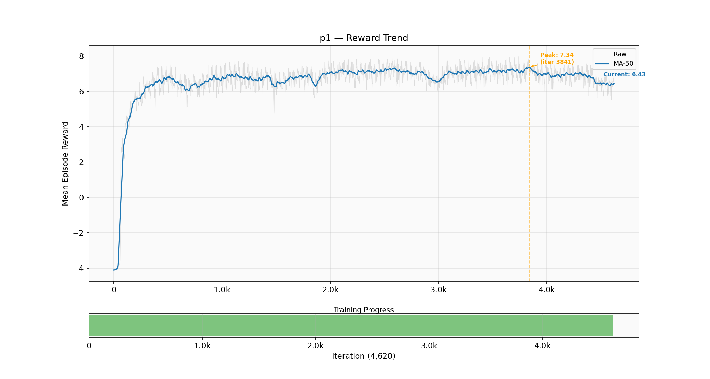
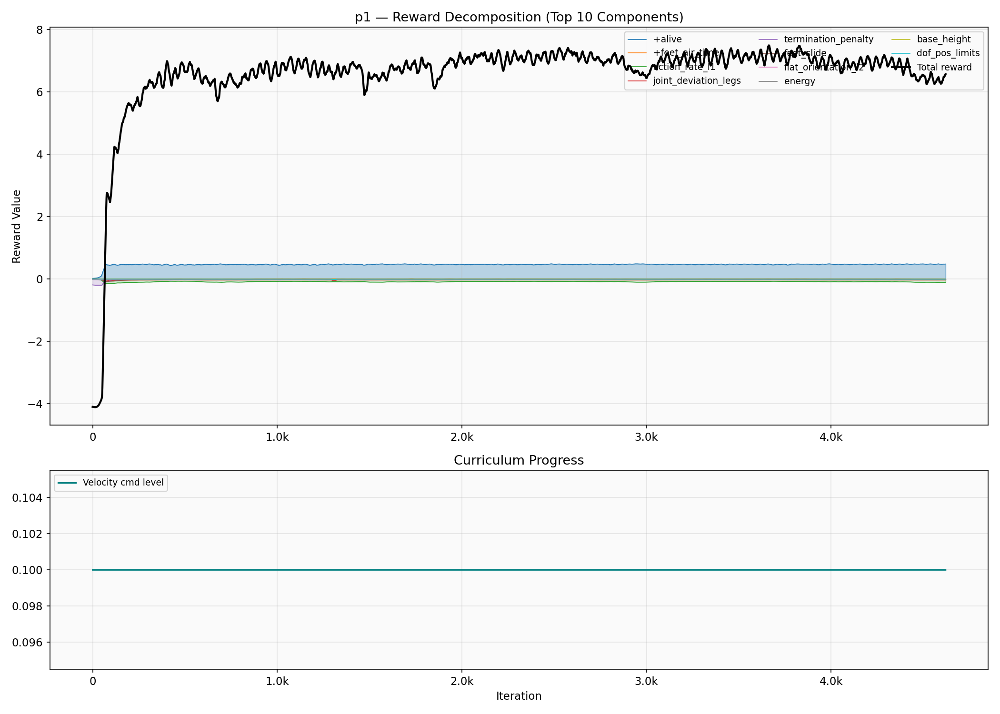
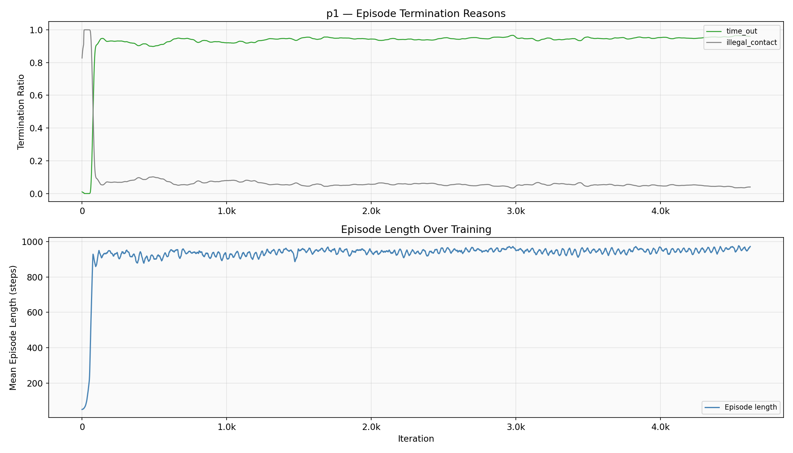
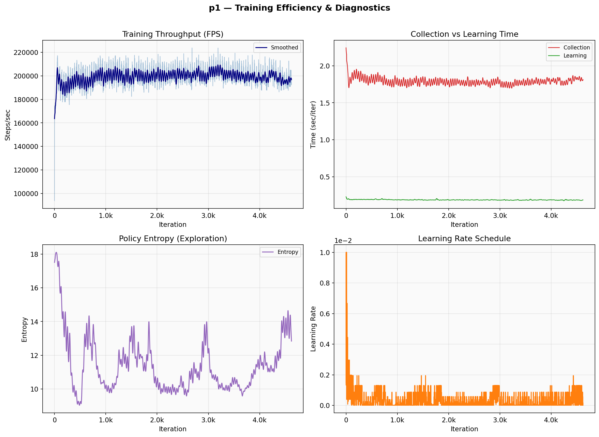

# Z1 12DOF Training Report — p1

**Generated:** 2026-05-22 17:24
**Status:** HEALTHY

## Summary

| Metric | Value |
|--------|-------|
| Peak Reward | 7.98 @ iter 3,740 |
| Best Checkpoint | model_3700.pt (reward: 7.23) |
| Latest | 6.53 @ iter 4,620 |
| Episode Length | 971 / 1000 (97%) |
| Time-out Rate | 95.88% |
| Velocity Error | 0.794 |

## Plots

