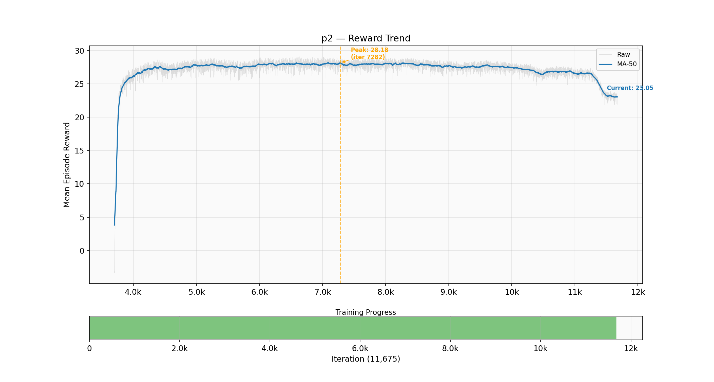
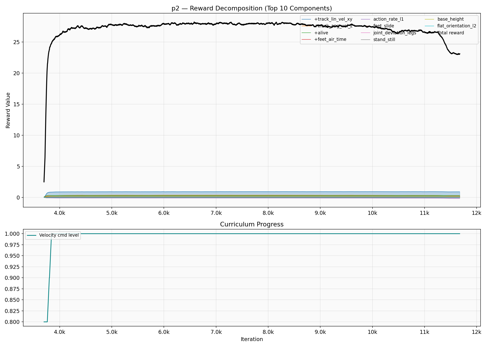
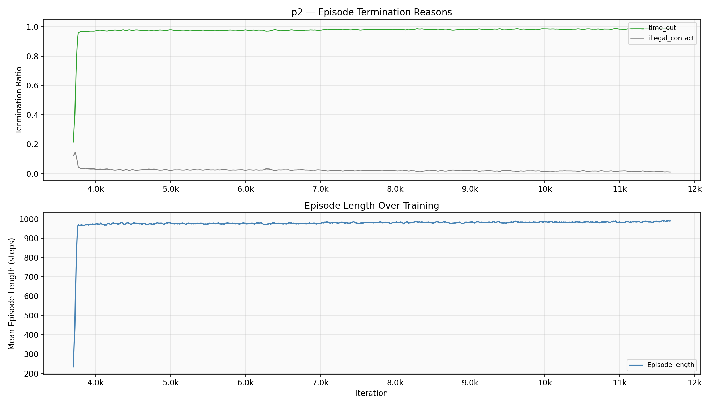
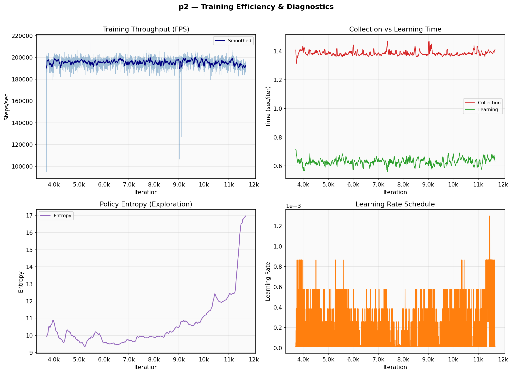

# Z1 12DOF Training Report — p2

**Generated:** 2026-05-22 17:24
**Status:** OVERFITTING

## Summary

| Metric | Value |
|--------|-------|
| Peak Reward | 39.85 @ iter 3,652 |
| Best Checkpoint | model_3700.pt (reward: 35.90) |
| Latest | 24.59 @ iter 6,704 |
| Episode Length | 980 / 1000 (98%) |
| Time-out Rate | 97.19% |
| Bad Orientation | 2.74% |
| Velocity Error | 0.377 |

**Overfitting reason:** Reward declined 38.3% from peak (24.59 vs peak 39.85@3652)

## Plots

