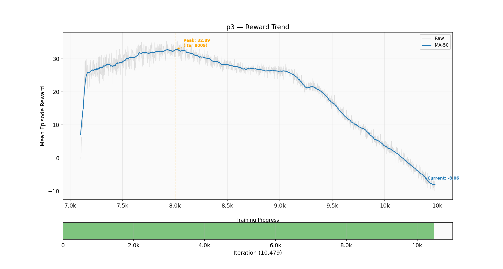
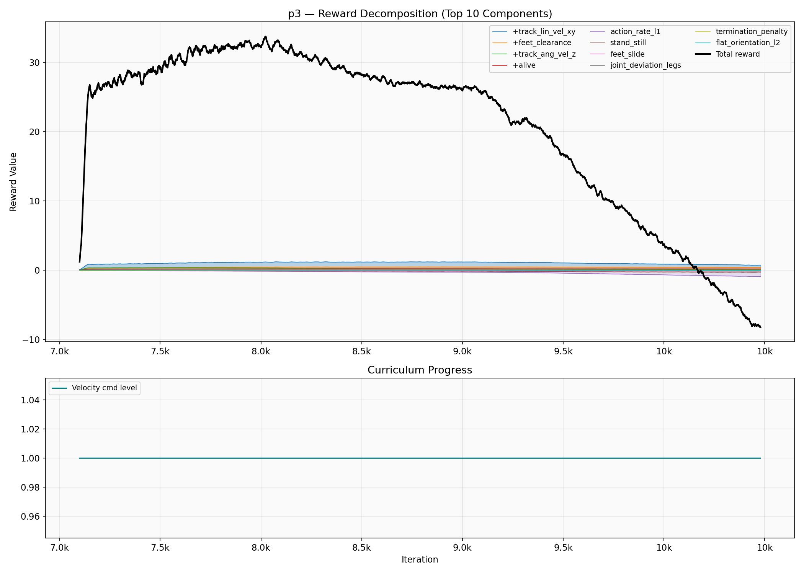
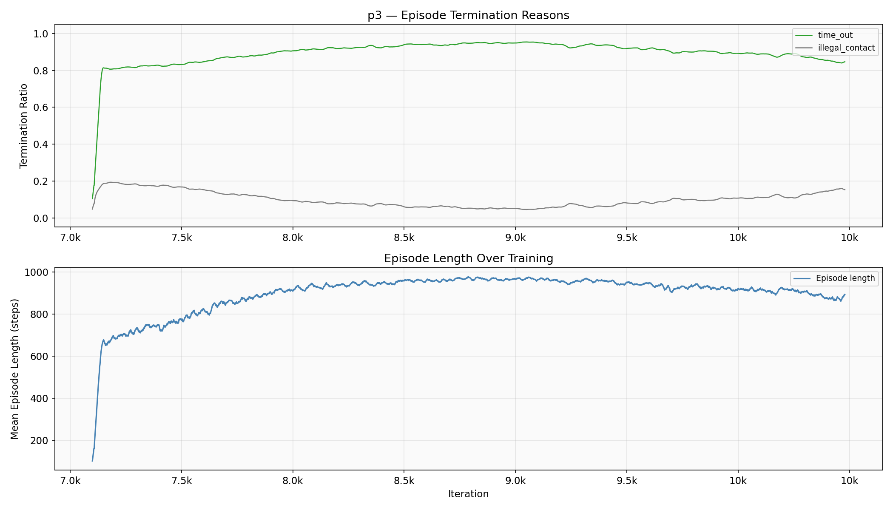
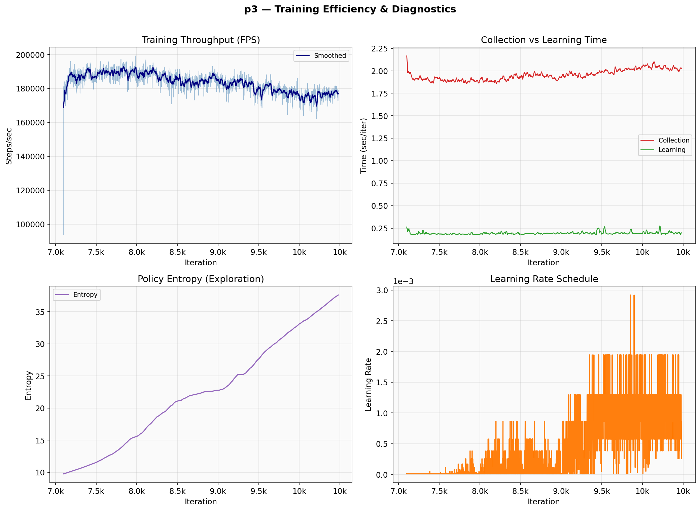

# Z1 12DOF Training Report — p3

**Generated:** 2026-05-22 17:24
**Status:** OVERFITTING

## Summary

| Metric | Value |
|--------|-------|
| Peak Reward | 38.47 @ iter 3,654 |
| Best Checkpoint | model_3700.pt (reward: 33.97) |
| Latest | 28.27 @ iter 6,200 |
| Episode Length | 919 / 1000 (92%) |
| Time-out Rate | 88.18% |
| Bad Orientation | 11.82% |
| Velocity Error | 0.412 |

**Overfitting reason:** Reward declined 23.8% from peak (29.30 vs peak 38.47@3654)

## Plots

